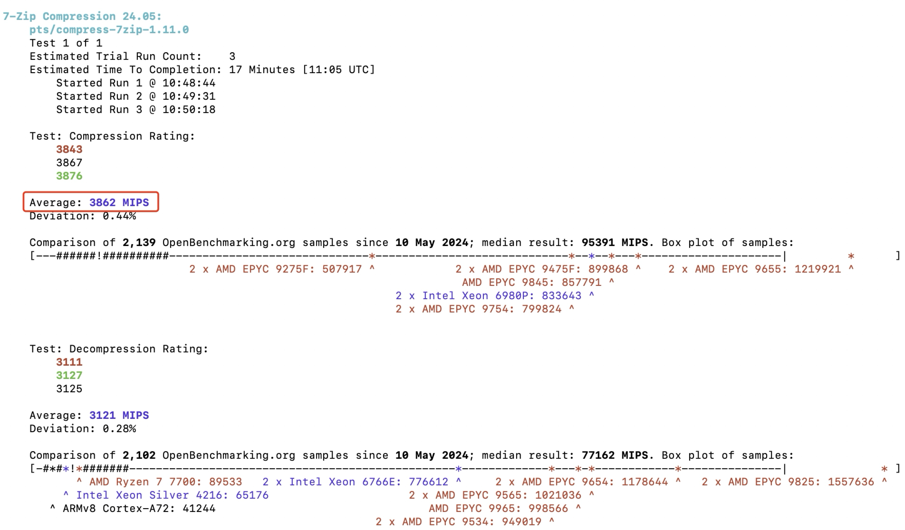
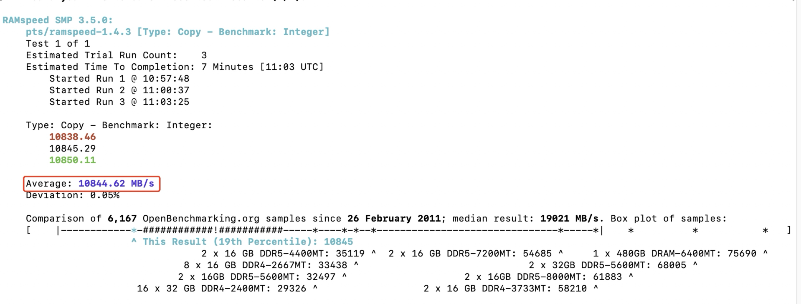

# CSIT5970 Assignment-1: EC2 Measurement (2 questions, 4 marks)

### Deadline: 11:59PM, Feb, 28, Friday

---

### Name: Yuan, Qibo
### Student Id: 21087441
### Email: qyuanac@connect.ust.hk

---

## Question 1: Measure the EC2 CPU and Memory performance

1. (1 mark) Report the name of measurement tool used in your measurements (you are free to choose *any* open source measurement software as long as it can measure CPU and memory performance). Please describe your configuration of the measurement tool, and explain why you set such a value for each parameter. Explain what the values obtained from measurement results represent (e.g., the value of your measurement result can be the execution time for a scientific computing task, a score given by the measurement tools or something else).

    > Your answer goes here.
    1. **The name of measurement tool:** Phoronix Test Suite
    2. **Configuration:**
        + **CPU performance:** 
            - **Command:** phoronix-test-suite run pts/compress-7zip
            - **Explain:** pts/compress-7zip is a test module identifier in the Phoronix Test Suite. It specifies that the test to be run is compress-7zip, a compression performance test using the 7-Zip compression tool.
        + **Memory performance:**
            - **Command:** phoronix-test-suite run pts/ramspeed
            - **Explain:** pts/ramspeed is a test module identifier in the Phoronix Test Suite that indicates running the RAMSpeed test
    3. **Explain the measurement results:**
        - **CPU performance:** The value represents how many megabytes of data the system can compress per second on average.
        
        - **Memory performance:** The value represents the average speed of copying data from one location to another in memory in megabytes per second.
        
2. (1 mark) Run your measurement tool on general purpose `t2.micro`, `t2.medium`, and `c5d.large` Linux instances, respectively, and find the performance differences among these instances. Launch all the instances in the **US East (N. Virginia)** region. Does the performance of EC2 instances increase commensurate with the increase of the number of vCPUs and memory resource?

    In order to answer this question, you need to complete the following table by filling out blanks with the measurement results corresponding to each instance type.

    | Size        | CPU performance | Memory performance |
    | ----------- | --------------- | ------------------ |
    | `t2.micro` |       3862 MIPS  |     10844.62 MB/s          |
    | `t2.medium`  |    10225 MIPS    |   19880.72 MB/s          |
    | `c5d.large` |     7298 MIPS     |   13085.20 MB/s          |

    > Region: US East (N. Virginia). Use `Ubuntu Server 22.04 LTS (HVM)` as AMI.

    No, it does not. Because the CPU and Memory performance of c5d.large are lower than those of t2.medium

## Question 2: Measure the EC2 Network performance

1. (1 mark) The metrics of network performance include **TCP bandwidth** and **round-trip time (RTT)**. Within the same region, what network performance is experienced between instances of the same type and different types? In order to answer this question, you need to complete the following table.

    | Type                      | TCP b/w (Mbps) | RTT (ms) |
    | ------------------------- | -------------- | -------- |
    | `t3.medium` - `t3.medium` |     3480            |     0.301     |
    | `m5.large` - `m5.large`   |       4950          |     0.142    |
    | `c5n.large` - `c5n.large` |       4950         |     0.163     |
    | `t3.medium` - `c5n.large` |      2440          |     0.707     |
    | `m5.large` - `c5n.large`  |      4960          |     0.174     |
    | `m5.large` - `t3.medium`  |      2320          |     0.619     |

    > Region: US East (N. Virginia). Use `Ubuntu Server 22.04 LTS (HVM)` as AMI. Note: Use private IP address when using iPerf within the same region. You'll need iPerf for measuring TCP bandwidth and Ping for measuring Round-Trip time.

    Based on the table, the network performance between instances of the same type is relatively better, showing higher TCP bandwidth and lower RTT, especially m5.large and c5n.large.
    The performance between instances of different types is relatively worse, but the performance between m5.large and c5n.large is good.

2. (1 mark) What about the network performance for instances deployed in different regions? In order to answer this question, you need to complete the following table.

    | Connection                | TCP b/w (Mbps) | RTT (ms) |
    | ------------------------- | -------------- | -------- |
    | N. Virginia - Oregon      |      31.9           |     62.6     |
    | N. Virginia - N. Virginia |       4930          |     0.205     |
    | Oregon - Oregon           |      4960           |     0.163     |
 
    > Region: US East (N. Virginia), US West (Oregon). Use `Ubuntu Server 22.04 LTS (HVM)` as AMI. All instances are `c5.large`. Note: Use public IP address when using iPerf within the same region.

    The instances deployed in different regions show lower TCP bandwidth and higher RTT than those of instances deployed in the same region.